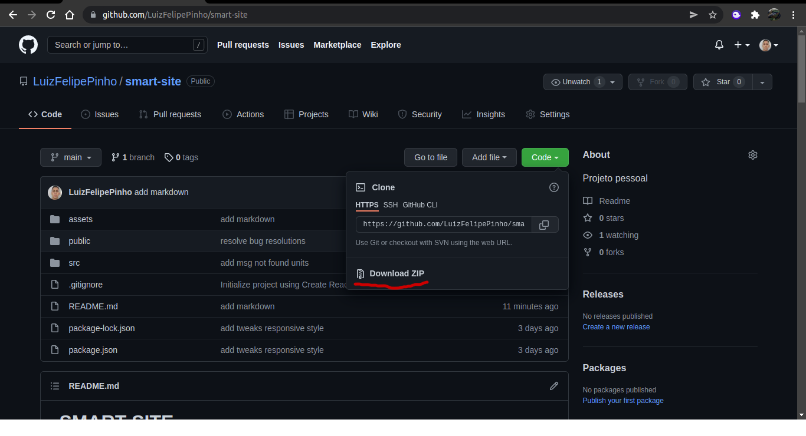

# SMART SITE 

Durante a pandemia de Covid19 diversos segmentos da indústria tiveram que se adequar com o novo modo de vida das pessoas, pensando nisso a Smart Fit propôs o seguinte desafio, desenvolver uma página que busque unidades fechadas ou abertas com informações específicas dessa unidade para consulta. Esse projeto foi criado com o intuito de praticar minhas habilidades em programação, portanto fiz algumas modificações como o filtro por UF, o desafio original foi proposto em https://github.com/bioritmo/front-end-code-challenge-smartsite e é usado para avaliar candidatos a vagas tech na Smart Fit.

 

## Funcionalidades
- Consume uma API externa da Smart Fit   
- Busca unidades com filtros de período do dia e UF   
- Previsão de resultados encontrados  
- Mostra unidades ao buscar  

 

## Demonstração da Aplicação
O projeto está hospedado em: https://smart-units.herokuapp.com/

 

- Versão mobile
<h1 style="display:flex; justify-content: space-between;">
  
  
  
  
</h1>

- Versão desktop
<h1 style="display:flex; justify-content: space-between;">
  
  
  
</h1>

## Pré requisito e como rodar a aplicação

É necessário ter o NodeJS instalado na sua máquina, use esse link do site oficial: 
 
https://nodejs.org/pt-br/download/

 
Após instalar o NodeJS, clique no botão verde e baixe os arquivos do projeto
  

Abra o terminal dentro da pasta do projeto e execute o seguinte comando: 
 
npm install

Após terminar de instalar as dependeências do projeto, use o seguinte comando para abrir o projeto:
 
npm start 

## Tecnologias usadas 

- ReactJS 
- CSS3
- HTML5