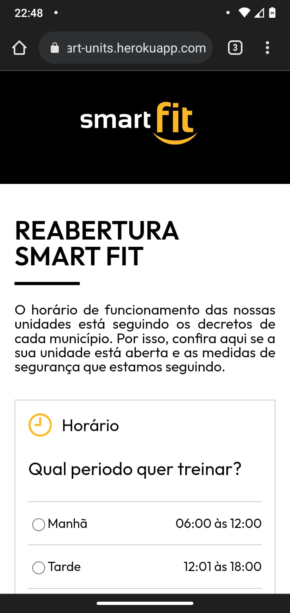
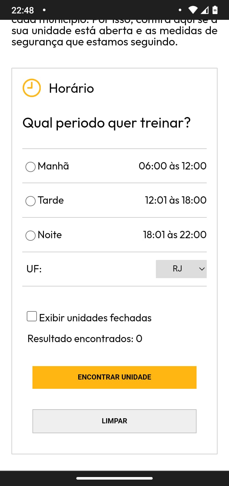
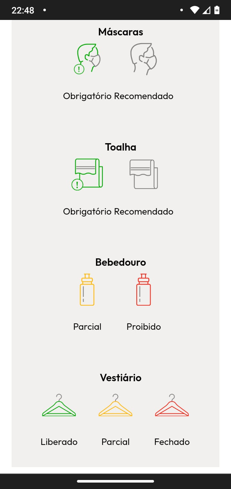
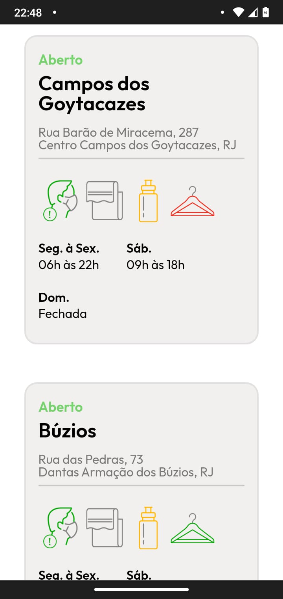
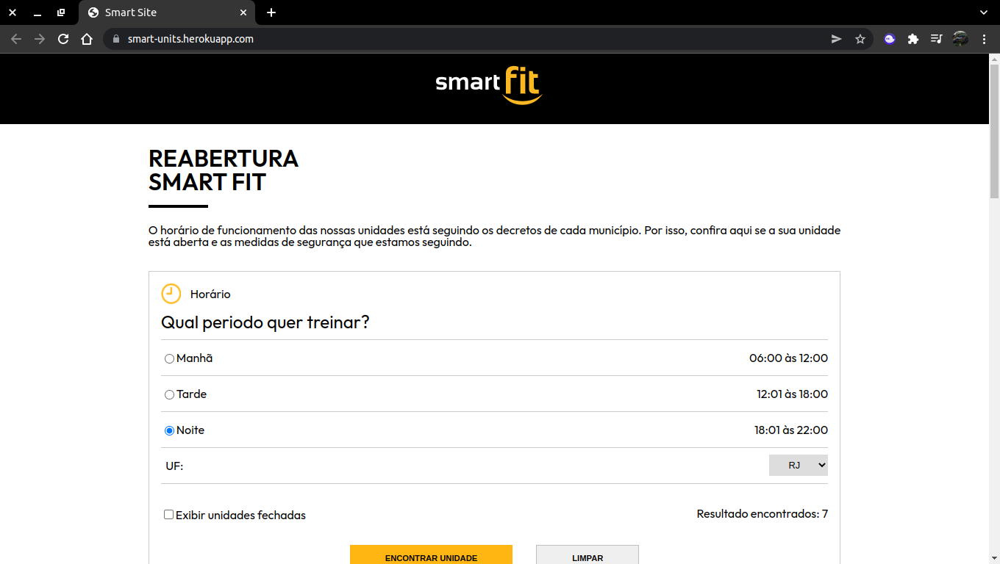
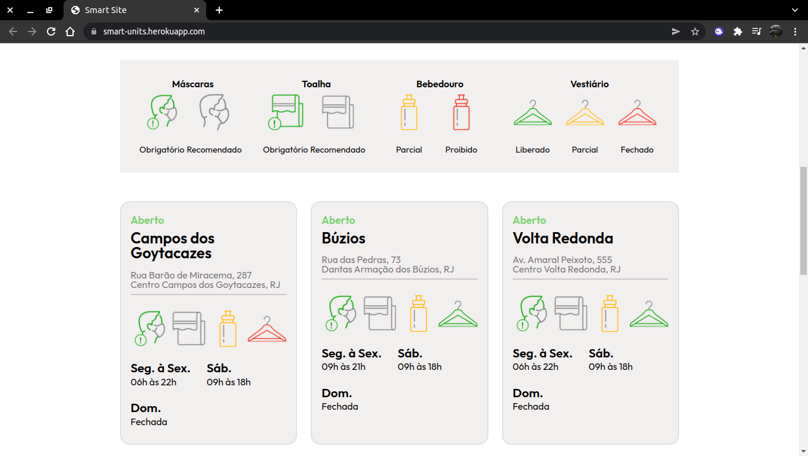
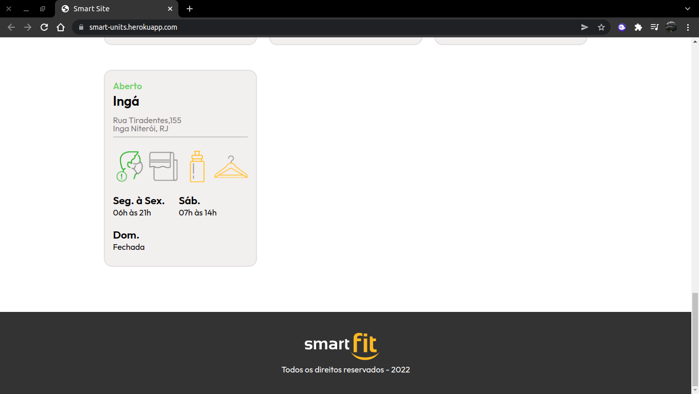

# SMART SITE 

Durante a pandemia de Covid19 diversos segmentos da indústria tiveram que se adequar com o novo modo de vida das pessoas, pensando nisso a Smart Fit propôs o seguinte desafio, desenvolver uma página que busque unidades fechadas ou abertas com informações específicas dessa unidade para consulta. Esse projeto foi criado com o intuito de praticar minhas habilidades em programação, portanto fiz algumas modificações como o filtro por UF, o desafio original foi proposto em https://github.com/bioritmo/front-end-code-challenge-smartsite e é usado para avaliar candidatos a vagas tech na Smart Fit.

 

## Funcionalidades
- Consume uma API externa da Smart Fit   
- Busca unidades com filtros de período do dia e UF   
- Previsão de resultados encontrados  
- Mostra unidades ao buscar  

 

## Demonstração da Aplicação
O projeto está hospedado em: https://smart-units.herokuapp.com/

 

- Versão mobile
<h1 style="display:flex; justify-content: space-between;">
  
  
  
  
</h1>

- Versão desktop
<h1 style="display:flex; justify-content: space-between;">
  
  
  
</h1>